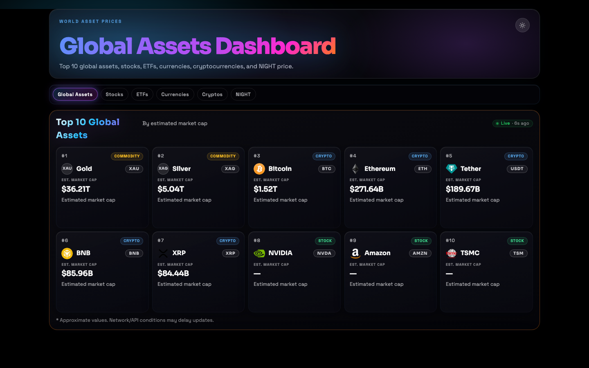

# World Asset Prices


**Live Site:** [coleyrockin.github.io/world-asset-prices](https://coleyrockin.github.io/world-asset-prices/)

---



---

## About

World Asset Prices is a full-stack React + Vercel dashboard tracking the top 10 cryptocurrencies, top 10 stocks, and top 10 global assets by market cap — live. Built with a resilient data layer (provider cache → stale fallback → durable cache), smooth Framer Motion animations, and a polished dark/light UI that works across all screen sizes.

A single `GET /api/dashboard` call powers the entire payload. The frontend never talks to external APIs directly.

## Features

- **Three asset categories** — cryptocurrencies, stocks, and global assets ranked by market cap
- **Light / dark mode** — toggles instantly, respects `prefers-color-scheme` on first load, persists preference
- **Search & filter** — find any asset by name or symbol across all categories simultaneously
- **Sort modes** — by rank, market cap, 24h change (high/low), or name
- **24h price change** — color-coded green/red on every card
- **7-day sparklines** — mini SVG trend charts on every crypto card
- **Watchlist** — pin assets to the top with localStorage persistence across sessions
- **Compare mode** — side-by-side comparison panel for up to 3 cryptocurrencies
- **Midnight Token (NIGHT) panel** — dedicated price display with ATH, market cap, and 24h volume
- **Last updated timestamp** — displays exact time of the most recent data snapshot
- **Auto-refresh** — refetches every 30 seconds via TanStack Query
- **Resilient data layer** — live → fresh cache → stale-if-error fallback → durable cache (Upstash/Vercel KV)
- **Production quality gates** — lint, typecheck, unit tests, E2E smoke tests, and bundle size check in CI

## Tech Stack

| Category | Technologies |
|----------|-------------|
| **Frontend** | React 19, TypeScript 5.9, Vite 7, TanStack React Query 5 |
| **Styling** | Tailwind CSS v4, clsx |
| **Animation** | Framer Motion 12 |
| **Backend** | Vercel Serverless Functions (Node 20) |
| **Data sources** | CoinPaprika (crypto), Financial Modeling Prep (stocks) |
| **Testing** | Vitest 4, Testing Library, Playwright E2E |
| **Linting** | ESLint 10, typescript-eslint |
| **Deployment** | Vercel (primary), GitHub Pages (static fallback) |

## Getting Started

```bash
# Clone
git clone https://github.com/coleyrockin/world-asset-prices.git
cd world-asset-prices

# Install dependencies
npm install

# Copy environment variables
cp .env.example .env
# Add your FMP_API_KEY (see Environment Variables below)

# Start the dev server
npm run dev
```

The app runs at `http://localhost:5188`.

## Environment Variables

Copy `.env.example` to `.env` and fill in:

| Variable | Required | Description |
|----------|----------|-------------|
| `FMP_API_KEY` | **Yes** | Financial Modeling Prep API key for stock data |
| `FMP_BASE_URL` | No | Override FMP base URL (default: `https://financialmodelingprep.com/api/v3`) |
| `COINPAPRIKA_BASE_URL` | No | Override CoinPaprika base URL |
| `CACHE_TTL_SEC` | No | How long to cache live data (default: `30`) |
| `FALLBACK_TTL_SEC` | No | How long stale cache is valid (default: `600`) |
| `KV_REST_API_URL` | No | Upstash/Vercel KV URL for durable cache |
| `KV_REST_API_TOKEN` | No | Upstash/Vercel KV token |

Get a free FMP API key at [financialmodelingprep.com](https://financialmodelingprep.com/developer/docs/).

## Available Scripts

| Command | Description |
|---------|-------------|
| `npm run dev` | Start Vite dev server on port 5188 |
| `npm run build` | Typecheck + production build |
| `npm run preview` | Preview production build |
| `npm run test` | Run unit/integration tests |
| `npm run test:e2e` | Run Playwright E2E tests |
| `npm run lint` | Lint with ESLint |
| `npm run typecheck` | TypeScript type checking |
| `npm run check` | Full CI pipeline (lint + typecheck + test + build + bundle check) |

## Project Structure

```
world-asset-prices/
├── .github/           # CI workflows and issue templates
├── api/               # Vercel serverless endpoints
│   ├── dashboard.ts   # Main data endpoint — GET /api/dashboard
│   ├── logo.ts        # Logo proxy — GET /api/logo?url=...
│   └── health.ts      # Health check — GET /api/health
├── server/            # Server-side logic (shared by api/ and dev server)
│   ├── providers/     # CoinPaprika and FMP data providers
│   ├── cache.ts       # In-memory cache with TTL
│   ├── durable-cache.ts # Upstash/Vercel KV integration
│   └── dashboard.ts   # Dashboard payload assembly
├── src/               # React frontend
│   ├── components/    # MarketCard, SectionHeader, LogoMark, etc.
│   ├── hooks/         # useTheme, useTilt
│   ├── lib/           # formatters, monogram utilities
│   ├── types/         # Shared TypeScript types
│   ├── App.tsx        # Main app component
│   └── globals.css    # Tailwind v4 entry + theme variables
├── tests/e2e/         # Playwright smoke tests
├── index.html         # Entry HTML
├── vite.config.ts     # Vite configuration (includes local API dev plugin)
├── vercel.json        # Vercel deployment config
└── package.json
```

## Contributing

1. Fork the repository
2. Create a feature branch: `git checkout -b feat/your-feature`
3. Make your changes and run `npm run check` to verify everything passes
4. Commit with a descriptive message: `git commit -m "feat: add your feature"`
5. Open a pull request against `main`

Please open an issue first for significant changes.

## License

MIT © Boyd Roberts
