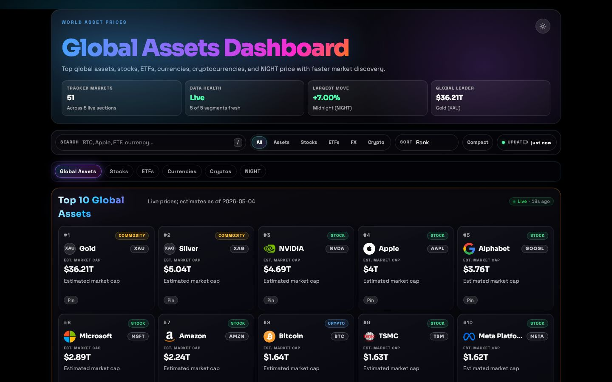

# World Asset Prices


**Live site:** [world-asset-prices.vercel.app](https://world-asset-prices.vercel.app)

World Asset Prices is a live market dashboard that compares major global public companies, private companies, ETFs, fiat currencies, cryptocurrencies, and the Midnight Token in one polished view. It is built as a portfolio-quality React/Vite app backed by Vercel serverless API routes and a resilient no-key data pipeline.

## Screenshots

<p align="center">
  
</p>

## What The App Does

The dashboard answers a simple question: what are the world's most valuable and most watched assets doing right now?

A single `GET /api/dashboard` endpoint composes the compact dashboard payload. `GET /api/asset-detail?id=...&range=...` powers the asset drawer with quote, provenance, confidence, source links, and history metadata. The frontend does not call external market APIs directly. Server routes fetch public-company and ETF prices from Stooq with Yahoo Finance as a no-key quote fallback, FX rates from Frankfurter, crypto prices from CoinPaprika, and verified curated values from `server/data/asset-value-sources.json`. The app layers fresh cache, stale cache, optional durable KV cache, and bundled fallback data so users see a useful dashboard even when an upstream provider is degraded.

No paid API key is required for local development or deployment.

## Main Features

- **Nine market sections:** Watchlist, Portfolio Lab, Global Assets, Public Companies, Private Companies, ETFs, Currencies, Cryptos, and NIGHT.
- **Live data controls:** Search, section filters, dense mode, and sortable grids by rank, name, value, or movement.
- **Pinned watchlist:** Pin any card and keep it available across sessions through local storage.
- **Asset detail drawer:** Click any card to inspect exact value, unit price, provenance, verified-as-of date, source link, confidence, limitations, plus Yahoo Finance v8 historical charts for stocks and ETFs over 7D / 30D / 1Y. Categories without a reliable no-key history provider show an honest unavailable state.
- **Local Portfolio Lab:** Track tradable stock, ETF, crypto, and NIGHT holdings with allocation, optional gain/loss, edit/remove controls, and JSON import/export.
- **Segment-level data health:** Hero and section badges distinguish `live`, `fresh-cache`, `stale-cache`, `durable-cache`, and `fallback` states.
- **Valuation transparency:** Public-company market caps, ETF AUM snapshots, commodities, and private-company valuations carry source metadata in the payload.
- **Private companies:** Verified primary private-company valuations are presented with the same grid, sorting, filtering, pinning, detail, and empty-state behavior as public markets; speculative targets appear only as alternate context.
- **Logo proxy:** Server-side proxy validates logo URLs, blocks private hosts, enforces allowlisted domains, limits response size, and rejects unsafe content types.
- **Light and dark themes:** System preference on first load, persistent user preference afterward.
- **Responsive dashboard UI:** Desktop, tablet, and mobile layouts with compact cards, sticky section nav, and touch-friendly controls.
- **Production gates:** Lint, typecheck, unit tests, route tests, E2E smoke tests, production build, bundle budget, and dependency audit.

## Tech Stack

| Area | Technology |
| --- | --- |
| Frontend | React 19, TypeScript 5.9, Vite 7, TanStack React Query 5 |
| Styling | Tailwind CSS 4, custom CSS theme tokens, clsx |
| Animation | Framer Motion 12, CSS transitions with reduced-motion support |
| Backend | Vercel Serverless Functions on Node 20 |
| Data Sources | Stooq, Yahoo Finance fallback quotes, Frankfurter / ECB, CoinPaprika, versioned curated source manifest |
| Cache | In-memory TTL cache plus optional Upstash / Vercel KV durable cache |
| Testing | Vitest 4, Testing Library, Playwright |
| Quality | ESLint 9, TypeScript strict mode, bundle-size guard |

## Data Health And Fallbacks

Every dashboard segment carries a source label:

- `live` or `fresh-cache`: current enough for normal operation.
- `stale-cache`: provider failed, but a recent cached response is still usable.
- `durable-cache`: optional KV cache supplied a previously good payload.
- `fallback`: bundled JSON snapshot was used as the last resort.

The hero **Data health** summary reports `Live` only when all provider-backed segments are live or fresh-cache and the curated source manifest is present. It reports `Degraded` when any provider segment is stale, durable-cache, or fallback, and lists the worst affected segments so the issue is actionable instead of vague. A segment clears its degraded marker as soon as it recovers.

## Private Companies

Private-company valuations are not live market prices. Primary values are verified curated marks sourced in `server/data/asset-value-sources.json` and mirrored into `server/fallback/dashboard-fallback.json`. Detail views label them as curated valuations, show the source and verified-as-of date, and keep targets or secondary-market chatter as alternate context instead of primary values.

## Portfolio Privacy

The Portfolio Lab is a local simulator, not brokerage software. Holdings are stored under `wap.portfolio.v1` in browser `localStorage`; they are never sent to dashboard APIs, URLs, client-error telemetry, logs, or analytics. Import/export uses plain JSON so users can move or back up local holdings manually.

## Local Setup

```bash
git clone https://github.com/coleyrockin/world-asset-prices.git
cd world-asset-prices
npm install
npm run dev
```

The app runs at `http://localhost:5188`.

## Environment Variables

All environment variables are optional. Copy `.env.example` to `.env` only if you want to tune cache windows, use durable KV, or change rate limits.

| Variable | Purpose | Default |
| --- | --- | --- |
| `COINPAPRIKA_BASE_URL` | CoinPaprika HTTPS origin override | `https://api.coinpaprika.com` |
| `STOOQ_BASE_URL` | Stooq HTTPS origin override | `https://stooq.com` |
| `YAHOO_FINANCE_BASE_URL` | Yahoo Finance quote fallback HTTPS origin override | `https://query1.finance.yahoo.com` |
| `FRANKFURTER_BASE_URL` | Frankfurter HTTPS origin override | `https://api.frankfurter.dev` |
| `CACHE_TTL_SEC` | Fresh in-memory cache TTL | `30` |
| `FALLBACK_TTL_SEC` | Stale cache TTL before last-resort fallback | `600` |
| `STALE_ALERT_SEC` | Age threshold for stale response warnings | `300` |
| `KV_REST_API_URL` / `KV_REST_API_TOKEN` | Optional Upstash / Vercel KV durable cache | unset |
| `LOGO_PROXY_*` | Logo proxy host allowlist, rate limits, and size caps | see `.env.example` |
| `TRUST_PROXY_HEADERS` | Self-hosting escape hatch for trusted reverse proxies | `false` |
| `CLIENT_ERROR_*` | Client-error payload and rate-limit limits | see `.env.example` |

Provider URL overrides must be exact HTTPS origins. The server rejects userinfo, paths, queries, fragments, and unexpected hosts.

## Available Scripts

| Command | Description |
| --- | --- |
| `npm run dev` | Start the local Vite app and API dev middleware |
| `npm run lint` | Run ESLint |
| `npm run typecheck` | Run all TypeScript project checks |
| `npm run test` | Run unit and integration tests for `src` and `server` |
| `npm run test:routes` | Run API route tests |
| `npm run test:e2e` | Run Playwright smoke tests |
| `npm run audit:data` | Validate source metadata, public-company coverage, private-company values, ETF AUM methodology, and NVIDIA sanity range |
| `npm run build` | Typecheck and build production assets |
| `npm run check:bundle` | Enforce the bundle-size budget |
| `npm run check` | Full local release gate: lint, typecheck, data audit, tests, route tests, build, bundle check |
| `npm run verify:production` | Check the live Vercel HTML/API, CSP, data health, ranking order, global public-company coverage, NVIDIA value, SpaceX verified value, and source metadata |
| `npm run preview` | Preview the production build locally |

## Testing And Validation

Recommended release validation:

```bash
npm run check
npm run test:e2e
npm run verify:production
npm audit --omit=dev
```

For visual QA, run `npm run dev`, open `http://localhost:5188`, and check desktop, tablet, and mobile breakpoints in both light and dark modes.

Deterministic Playwright fixtures cover live, degraded, fallback, empty, long-name, logo-failure, detail-drawer, portfolio, light, dark, desktop, and mobile states.

## Deployment Notes

The app is configured for Vercel:

- `vercel.json` routes `/api/*` requests to serverless handlers.
- Static assets are built by Vite into `dist/`.
- Security headers include CSP, frame protection, referrer policy, and permissions policy.
- Optional KV credentials can improve fallback durability, but deployment works without them.
- `.github/workflows/production-verify.yml` runs the live production verifier every four hours and can be triggered manually.

## Project Structure

```text
world-asset-prices/
├── .github/            # CI, dependency review, templates, CODEOWNERS
├── api/                # Vercel serverless endpoints
├── server/             # Provider, cache, security, schema, source manifest, and fallback logic
├── src/                # React app, components, hooks, utilities, styles
├── tests/e2e/          # Playwright smoke tests
├── docs/               # Public screenshots
├── public/             # Static preview assets
├── index.html          # Vite entry HTML and social tags
├── vite.config.ts      # Vite config plus local API middleware
├── vercel.json         # Production routing and headers
└── package.json        # Scripts, metadata, dependencies
```

## Roadmap

Shipped:

- Live public-company, ETF, FX, and crypto sections with resilient fallback behavior.
- Global public-company coverage with curated snapshots where no-key quote providers do not cover an exchange.
- Private-company section with verified primary values, alternate valuation context, sorting, filtering, pinning, and health metadata.
- Asset detail drawer with provenance, verified-as-of dates, source links, confidence, limitation copy, and Yahoo-Finance-backed historical charts for stocks and ETFs (7D / 30D / 1Y).
- Local-only Portfolio Lab with holdings persistence, allocation, optional gain/loss, edit/remove, and JSON import/export.
- Price-derived public-company market caps, sourced ETF AUM snapshots, and audited curated valuation metadata.
- Segment-level data health and provider transparency.
- Hardened logo proxy, client-error endpoint limits, and trusted-proxy handling.

Next:

- Add provider redundancy for public-company fundamentals.
- Extend historical chart coverage to crypto, currencies, commodities, private companies, and NIGHT (stocks and ETFs are already covered via Yahoo Finance v8).
- Add portfolio scenario tools such as rebalance targets and what-if price changes.
- Add optional cross-device watchlist sync.
- Add visual regression coverage for core dashboard states.

## Known Limitations

- Public-company market caps combine live quotes where available with audited share-count or market-data baselines; they are not exchange-certified real-time fundamentals.
- ETF AUM values are sourced snapshots and can differ across issuer and market-data sites.
- Private-company valuations are curated verified primary marks and can lag new funding rounds or secondary-market marks.
- Historical charts are available for stocks and ETFs (7D / 30D / 1Y) via the Yahoo Finance v8 chart endpoint and prefer adjusted close. The Stooq CSV history path now requires an API key, so it serves only as an opportunistic fallback. Crypto, currencies, commodities, private companies, and NIGHT still show an honest unavailable state until each category gets a reliable no-key history provider.
- Free providers can rate limit or temporarily fail, which may show as `stale-cache`, `durable-cache`, or `fallback` in Data health.
- Portfolio data is local to one browser profile and does not sync across devices.

## Security Notes

- Keep `.env` and all real KV tokens out of git; `.gitignore` already excludes local env files.
- The frontend receives only aggregated dashboard data from local API routes.
- Provider origin overrides are HTTPS-only and expected-host-only.
- Logo proxy requests are validated, rate limited, size limited, and restricted to safe image content types.
- Client error reporting trims and hashes stack details before logging to reduce accidental sensitive data retention.
- Local portfolio holdings stay client-side and are excluded from API payloads and telemetry.

## Credits

Built by Boyd Roberts. Market data comes from Stooq, Yahoo Finance fallback quotes, Frankfurter / ECB, CoinPaprika, and verified curated valuation/source snapshots for public-company gaps, ETFs, commodities, and private companies.

## License

MIT (c) Boyd Roberts
