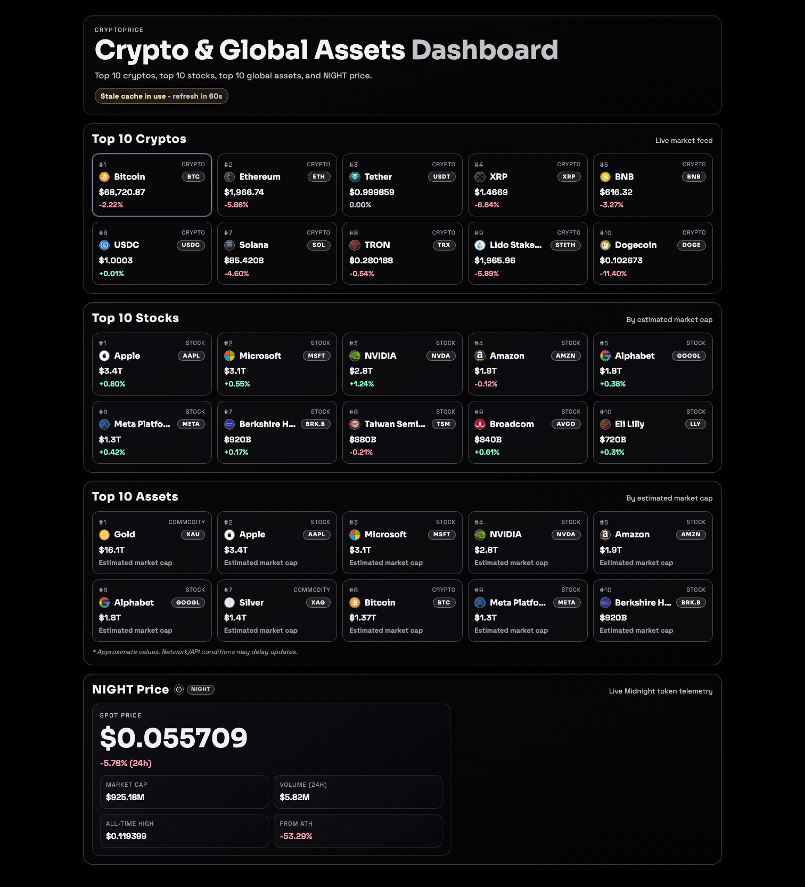
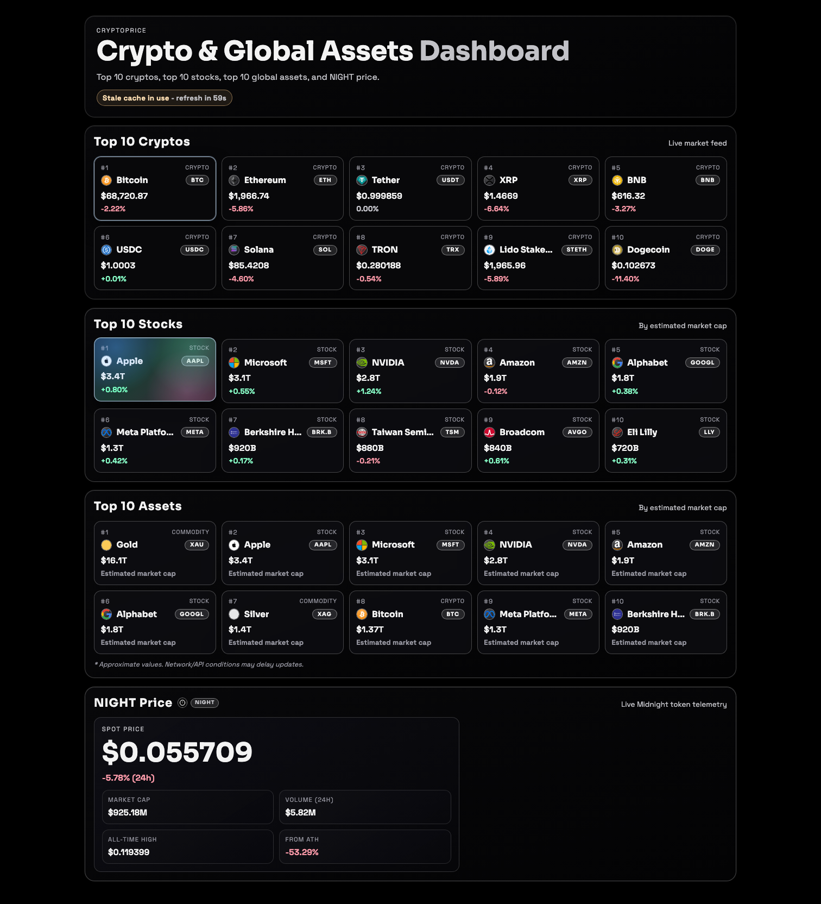
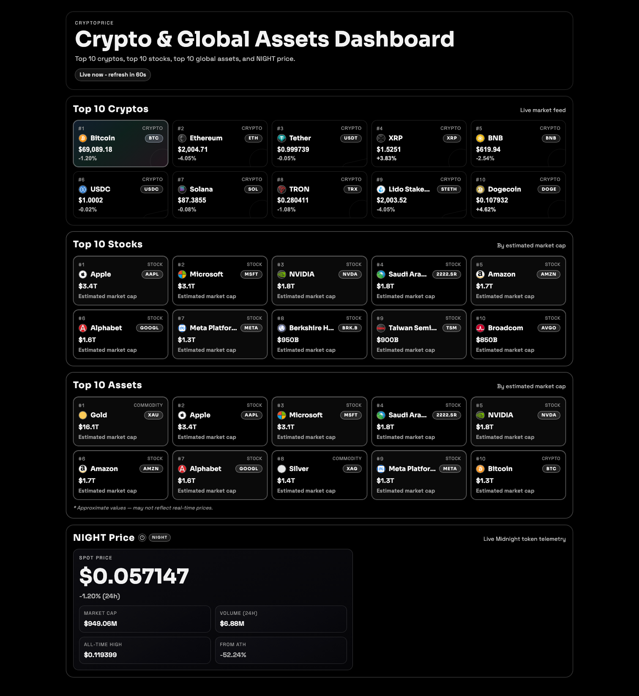
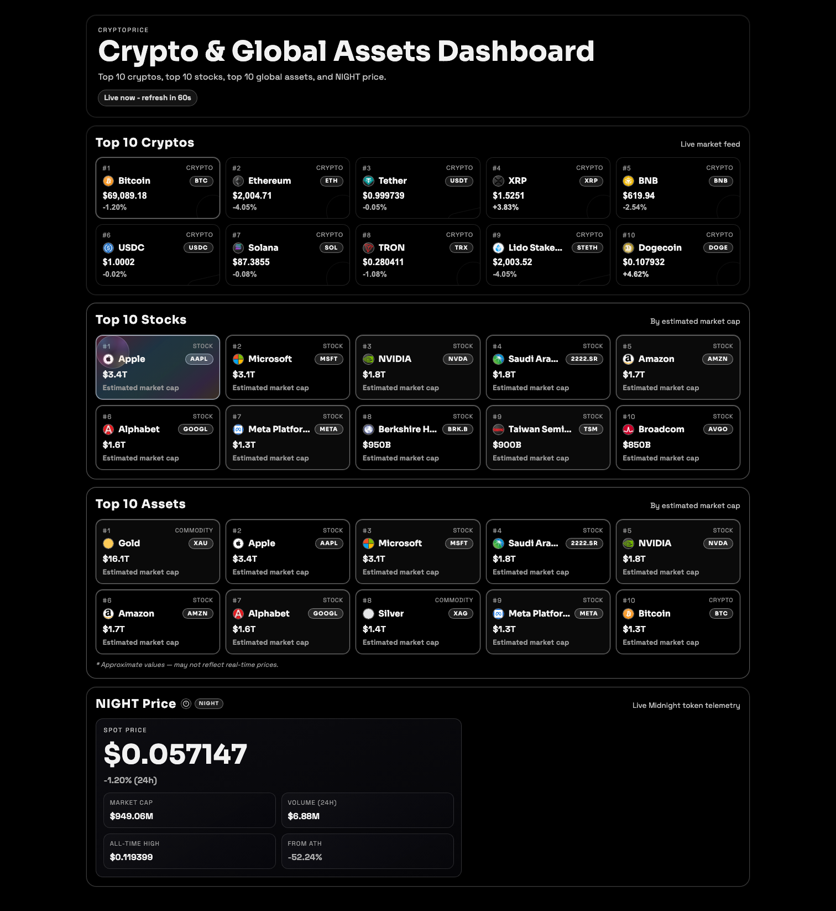

# World Asset Prices

[](https://github.com/coleyrockin/cryptoprice/actions/workflows/ci.yml)
[](https://opensource.org/licenses/MIT)


**[🚀 Live Demo →](https://coleyrockin.github.io/cryptoprice/)**

A full-stack market dashboard tracking the **top 10 cryptocurrencies**, **top 10 stocks**, and **top 10 global assets** by market cap — built with React, TypeScript, and Vercel serverless functions, with a multi-layer reliability architecture and a glassmorphism UI.

---

## Preview

<table>
  <tr>
    <td></td>
    <td></td>
  </tr>
  <tr>
    <td align="center"><em>Dashboard overview</em></td>
    <td align="center"><em>Glass hover treatment</em></td>
  </tr>
  <tr>
    <td></td>
    <td></td>
  </tr>
  <tr>
    <td align="center"><em>Crypto card detail</em></td>
    <td align="center"><em>Global asset card</em></td>
  </tr>
</table>

---

## What It Does

World Asset Prices gives you a single, fast-loading dashboard for the most important markets at a glance:

| Section | Content |
|---|---|
| **Top Cryptos** | Top 10 by market cap (CoinPaprika), with 7-day sparklines and 24h change |
| **Top Stocks** | Top 10 equities by market cap (FinancialModelingPrep) |
| **Top Global Assets** | Combined ranking of the world's largest crypto and equity assets |
| **NIGHT Panel** | Dedicated panel for Midnight Token (`NIGHT`) with ATH distance and 24h volume |

Key UX features include live price polling, search, category filtering, multi-mode sorting, watchlist pinning, and side-by-side compare mode.

---

## Tech Stack

| Layer | Technology |
|---|---|
| **Frontend** | React 19, TypeScript, Vite, Framer Motion |
| **Data Fetching** | TanStack React Query (polling + stale-while-revalidate) |
| **Backend** | Vercel Serverless Functions (Node.js 20) |
| **Data Providers** | FinancialModelingPrep (stocks), CoinPaprika (crypto) |
| **Caching** | In-memory TTL cache + stale-if-error fallback + optional Upstash/Vercel KV |
| **Testing** | Vitest (unit/integration), Playwright (E2E smoke) |
| **Linting / Types** | ESLint, TypeScript strict mode |
| **Deployment** | Vercel (full-stack), GitHub Pages (frontend demo) |

---

## Architecture

```
Frontend (React + React Query)
  └─▶  GET /api/dashboard
         └─▶  Server aggregation layer
                ├─▶  FinancialModelingPrep  (stocks / equities)
                ├─▶  CoinPaprika            (top cryptos + NIGHT token)
                ├──  In-memory TTL cache    (30 s default)
                ├──  Stale-if-error window  (600 s default)
                ├──  Local JSON fallback    (last-known-good payload)
                └──  Optional durable KV   (Upstash / Vercel KV REST)
```

A single `GET /api/dashboard` call returns all segments, keeping the client simple and fast. Each segment tracks its own source (`live`, `fresh-cache`, `stale-cache`, `fallback`, or `durable-cache`) and age, so degradation is always visible in the response metadata.

---

## API Endpoints

| Endpoint | Description |
|---|---|
| `GET /api/dashboard` | Normalized market payload with degradation metadata and request ID |
| `GET /api/health` | Readiness status (`ready` / `degraded` / `down`), provider checks, and runtime metrics |
| `GET /api/logo?url=…` | Secure logo proxy with host allowlist, size limits, and rate limiting |
| `POST /api/client-error` | Schema-validated client error ingestion with body-size guard and rate limiting |

<details>
<summary>Dashboard response shape</summary>

```json
{
  "generatedAt": "2026-02-23T00:00:00.000Z",
  "stale": false,
  "refreshInSec": 30,
  "source": {
    "equities": "fmp",
    "crypto": "coinpaprika",
    "fallbackUsed": false
  },
  "degradedSegments": [],
  "segmentMeta": {
    "topCryptos": { "source": "live", "ageSec": 0 },
    "topStocks":  { "source": "live", "ageSec": 0 },
    "night":      { "source": "live", "ageSec": 0 }
  },
  "requestId": "f83a90f9-7b34-4cae-b6f6-0fbcb84f8bb3",
  "topCryptos": [],
  "topStocks": [],
  "topAssets": [],
  "night": null
}
```

</details>

---

## Reliability Model

The server never returns a blank page to the user, even during provider outages:

1. **Fresh cache** (`CACHE_TTL_SEC`, default `30 s`) — serve in-memory cached segment.
2. **Stale cache** (`FALLBACK_TTL_SEC`, default `600 s`) — serve stale in-memory data on provider failure.
3. **Local JSON fallback** — serve a validated last-known-good payload bundled with the app.
4. **Durable KV cache** *(optional)* — read/write from Upstash or Vercel KV for recovery from broad outages.

All provider numbers are sanitized before output to prevent `NaN` or `Infinity` from reaching the client.

---

## Quick Start

**Prerequisites:** Node.js `20.x` or newer, npm `10.x` or newer.

You will need a free [FinancialModelingPrep](https://financialmodelingprep.com/) API key for stock data. Crypto data from CoinPaprika requires no key.

```bash
npm install
cp .env.example .env   # add your FMP_API_KEY
npm run dev
```

Open [http://localhost:5188](http://localhost:5188).

### Environment Variables

| Variable | Required | Description |
|---|---|---|
| `FMP_API_KEY` | ✅ | FinancialModelingPrep API key |
| `FMP_BASE_URL` | ✅ | FMP base URL (set in `.env.example`) |
| `COINPAPRIKA_BASE_URL` | ✅ | CoinPaprika base URL (set in `.env.example`) |
| `CACHE_TTL_SEC` | — | In-memory cache TTL (default `30`) |
| `FALLBACK_TTL_SEC` | — | Stale-cache window (default `600`) |
| `KV_REST_API_URL` | — | Upstash / Vercel KV URL for durable cache |
| `KV_REST_API_TOKEN` | — | KV auth token |
| `DURABLE_CACHE_KEY` | — | KV key (default `wap:dashboard:payload`) |
| `STALE_ALERT_SEC` | — | Age threshold for stale alerts |
| `LOGO_ALLOWED_HOSTS` | — | Comma-separated logo proxy allowlist |
| `LOGO_PROXY_TIMEOUT_MS` | — | Logo proxy request timeout |
| `LOGO_PROXY_MAX_BYTES` | — | Max logo response size |
| `LOGO_PROXY_RATE_LIMIT_PER_MIN` | — | Logo proxy rate limit |
| `CLIENT_ERROR_MAX_BYTES` | — | Max client-error payload size |
| `CLIENT_ERROR_RATE_LIMIT_PER_MIN` | — | Client-error endpoint rate limit |

---

## Scripts

| Command | Description |
|---|---|
| `npm run dev` | Start local dev server with API plugin |
| `npm run build` | Typecheck + production build |
| `npm run preview` | Serve production build locally |
| `npm run lint` | Run ESLint |
| `npm run lint:fix` | Auto-fix lintable issues |
| `npm run typecheck` | TypeScript checks across all projects |
| `npm run test` | Vitest unit/integration suite |
| `npm run test:routes` | API route test suite |
| `npm run test:e2e` | Playwright smoke test |
| `npm run check:bundle` | Fail if main bundle exceeds size budget |
| `npm run check` | Full local gate: lint + typecheck + tests + build + bundle |

---

## Testing and Quality Gates

CI enforces the full gate on every push and pull request. To replicate locally:

```bash
npm run check   # runs all gates in sequence
```

Individual checks:

```bash
npm run lint
npm run typecheck
npm run test
npm run test:routes
npm run build
npm run check:bundle
npm run test:e2e   # requires Playwright browsers: npx playwright install chromium
```

Coverage focus:

- Formatter correctness and invalid number handling
- Provider normalization and schema mapping
- Fallback/cache behavior in dashboard assembly
- UI smoke flow — sections, logos, ticker pills, hover cards, status updates

---

## Project Structure

```
api/                  Vercel serverless route handlers
server/               Provider adapters, aggregation, cache, metrics, sanitization
  providers/          CoinPaprika and FMP adapter modules
  fallback/           Bundled last-known-good JSON payload
src/                  React app — components, styles, client API wrappers
  components/         MarketCard, LogoMark, SectionHeader, ErrorBoundary
  lib/                Formatters and utilities
  types/              Shared TypeScript type definitions
tests/e2e/            Playwright smoke tests
docs/                 Screenshot assets for README
scripts/              Build tooling (bundle budget check)
```

---

## Deployment

The app is designed for **Vercel full-stack deployment**:

1. Import the repository into Vercel.
2. Set the required environment variables (`FMP_API_KEY`, `COINPAPRIKA_BASE_URL`, and optionally the KV cache vars).
3. Vercel auto-detects the Vite framework and deploys the `api/` directory as serverless functions.

Config reference: [`vercel.json`](./vercel.json) — framework `vite`, output `dist`, API runtime `nodejs20.x`.

A **GitHub Pages build** of the static frontend is also deployed on every push to `main` via the [`pages.yml`](./.github/workflows/pages.yml) workflow. This build runs without API keys, so it uses the bundled fallback payload and is suitable as a live portfolio demo.

---

## Contributing and Policies

- [CONTRIBUTING.md](./CONTRIBUTING.md) — setup, branching, PR, and code standards
- [ROADMAP.md](./ROADMAP.md) — planned features and improvements
- [CHANGELOG.md](./CHANGELOG.md) — version history
- [CODE_OF_CONDUCT.md](./CODE_OF_CONDUCT.md)
- [SECURITY.md](./SECURITY.md) — vulnerability reporting

---

## License

MIT. See [LICENSE](./LICENSE).
